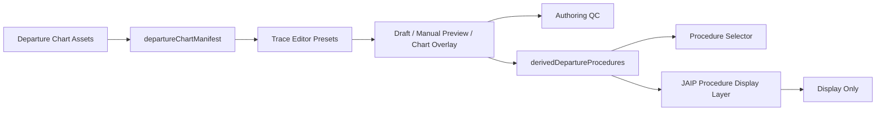

# RJCC ATC Simulator - 架构与生产工作指导 v4.1

## 一、文档定位

v4.1 是 v4.0 package foundation 之后的进度整理与执行指导。

v4.0 解决的问题是：

- 建立 `global / regions / sectors / airports` 四层数据边界
- 明确 RJCC Sector、RJCC Airport、RJCC ACA boundary 的关系
- 保留现有 JAIP / trace editor 工具链
- 开始 Canvas-first 静态地图渲染

v4.1 关注的新现实是：

- RJCC 离场程序生产管线已经开始形成
- 航图资产不再只有 KURIS 7 / CHITOSE 4
- Procedure Authoring Tool 已增加 manifest、草稿保存和 QC 能力
- Global Database / importer 的 P-1.5 基础代码已经落地
- RNAV SID 显示工作流已经进入试验阶段，但仍不能等同于 aircraft guidance

一句话判断：

```txt
项目已经从“结构包装阶段”进入“RJCC SID display atlas 生产工具与 RNAV 显示验证阶段”。
```

## 二、本次遍历范围

本次整理以 v4 foundation 提交 `ab7cff0` 为比较基线。

已推送 / 已提交比较终点：

```txt
origin/main = 0748a97
commit: Add RJCC procedure authoring QC and autosave workflow
date: 2026-05-21
```

本地 `main` 当前与本地可见的 `origin/main` 指向同一提交。GitHub 也确认 `0748a97` 提交存在：

```txt
https://github.com/Qishop1/atc-radar-sim/commit/0748a9773849269cb7de9db4361d0c0656d9adc7
```

比较结果：

- v4 foundation 之后已推送变化：53 个文件，3359 行新增，256 行删除
- 当前工作区另有未提交变化：7 个文件，570 行新增，81 行删除
- 当前未提交变化没有在本文中被当作已发布能力

## 三、v4.1 核心变化总结

### 1. P-1.5 数据基础已经从计划进入代码阶段

v4.0 时，`src/data/global` 主要还是 wrapper。

目前已新增或升级：

```txt
src/data/global/recordAdapters.js
src/data/global/resolveFix.js
src/data/importers/coordinateParsers.js
tools/importers/checkCoordinateParsers.js
tools/importers/importVatsimSct.js
tools/importers/importJcabBoundary.js
```

现在已经具备：

- 将现有 RJCC seed 统一映射为 global record 的 adapter
- `source / airac_cycle / fir / status` 字段入口
- `resolveFixCandidates(ref)`
- `resolveFixDiagnostics(ref)`
- 重复 id conflict 检测
- VATSIM `.sct` DMS parser
- JCAB compact DMS parser
- VATSIM fix / navaid / airport draft importer
- JCAB boundary draft importer

仍未完成：

- Global 数据仍以既有 RJCC seed 为主要来源
- 真实 VATSIM / JCAB 输入结果还没有作为正式 runtime database 合并
- `source` 与 `airac_cycle` 仍需要用实际来源校对
- RJCC ACA boundary 尚未完成正式 ENR 数据替换验证

结论：

```txt
P-1.5 的工具基础已完成第一版，但正式数据采纳与交叉校验仍待进行。
```

### 2. 离场航图库已从两个样板扩大为生产候选清单

新增文件：

```txt
src/data/airports/rjcc/departureChartManifest.js
```

新增航图资产：

```txt
DALBI_ONE.png
HAKODATE_SEVEN.png
HOKUTO_SEVEN.png
JUGGLAR_ONE.png
MUKAWA_EIGHT.png
NAGANUMA_FIVE.png
PATRUSH_ONE.png
REZOT_TWO.png
SAVIT_TWO.png
SOSHU_ONE.png
TEKKO_ONE.png
TOBBY_EIGHT.png
TOKACHI_TWO.png
YOSAN_ONE.png
YUFUTSU_FIVE.png
```

连同原有：

```txt
KURIS_SEVEN.png
CHITOSE_FOUR.png
```

RJCC departure chart 资产现已有 17 张。

`departureChartManifest.js` 的角色是：

- 注册离场航图
- 提供 chart option
- 提供 authoring preset
- 标识 `verified` 或 `pending_trace`
- 连接 chart、procedure id、runway variant、route fixes 与 authoring tool

当前已推送状态中：

- KURIS SEVEN = verified conventional display seed
- CHITOSE FOUR = verified conventional display seed
- DALBI ONE = RNAV SID authoring / display candidate，仍标记为 `pending_trace`
- 其余新增图件大多仍为 `pending_trace` 或 chart-only 候选

结论：

```txt
航图收集阶段已经明显推进，但“有 chart asset”不等于“procedure 已完成显示生产”。
```

### 3. Procedure Authoring Export V1 已经固化

新增文档：

```txt
docs/RJCC_PROCEDURE_AUTHORING_EXPORT_V1.md
```

它冻结了现有 display-only 管线的关键约定：

- manual preview object shape
- chart overlay object shape
- JS / JSON export 行为
- KURIS 7 / CHITOSE 4 selector id 稳定性
- display data 与 aircraft guidance 的隔离原则

这是 v4.0 中“先用 KURIS 7 / CHITOSE 4 固化 P0 模板”的直接落地成果。

### 4. DALBI ONE 成为第一批 RNAV 显示路线试验数据

已推送新增：

```txt
src/data/airspace/rjcc/chart-overlays/DALBI_ONE.chartOverlay.js
src/data/airspace/rjcc/chart-overlays/DALBI_ONE_RWY19.js
src/data/airspace/rjcc/manual-previews/DALBI_ONE_RWY01.js
```

相关代码还扩展了：

- `src/data/airspace/rjcc/procedures.js`
- `src/core-v2/procedures/procedureRouteBuilder.js`
- `src/map/jaip/ProcedureRouteLayer.jsx`

能力变化：

- RNAV route 可以基于 fix sequence 生成显示路线
- DALBI ONE 已有 procedure display record
- DALBI ONE RWY01 已有 manual preview
- DALBI ONE 已有 chart overlay authoring 文件
- RNAV start connector 已加入显示路径构建逻辑

必须保持的判断：

- DALBI ONE 是 RNAV display workflow candidate
- 已推送 manifest 中 DALBI 仍为 `pending_trace`
- 它不能被写成“RNAV SID workflow 已全面验证”
- 它也不能用于 aircraft guidance

### 5. Procedure production pipeline 已能把 authoring 数据接入显示层

新增：

```txt
src/data/airspace/rjcc/derivedDepartureProcedures.js
```

并调整：

```txt
src/data/airspace/rjcc/procedures.js
src/core-v2/procedures/procedureLookup.js
src/core-v2/procedures/procedureRouteBuilder.js
src/map/jaip/ProcedureRouteLayer.jsx
```

现在的链路是：

```txt
departure chart manifest
  -> authoring preset
  -> trace editor / manual preview / chart overlay
  -> derivedDepartureProcedures
  -> procedure selector / JAIP display layer
```

`derivedDepartureProcedures` 明确生成：

```js
{
  displayOnly: true,
  guidanceEnabled: false,
  legs: null
}
```

其中用于显示的 `segments` / `routeFixes` 不等于 P2 navigation legs。

### 6. Procedure Authoring Tool 已进入可生产工具阶段

已推送扩展集中在：

```txt
src/prototypes/rjcc-trace-editor/RjccProcedureTraceEditor.jsx
src/prototypes/rjcc-trace-editor/traceEditorDraftStorage.js
src/prototypes/rjcc-trace-editor/procedureAuthoringQc.js
```

目前已经加入：

- departure chart manifest 驱动的 authoring presets
- RNAV route builder
- waypoint snapping 改进
- RNAV start connector
- localStorage 草稿保存 / 恢复 / 自动保存
- QC / QA 面板
- QC report / JSON / unresolved fixes / readiness summary 复制
- export 文件内携带 QC 状态信息
- display-only / guidance disabled / legs null 安全标记

因此，`#/rjcc-trace-editor` 的定位可以更新为：

```txt
Procedure Authoring Tool prototype -> RJCC procedure display production tool v1
```

它仍然不是：

- Leg Authoring Tool
- Aircraft Guidance Tool
- FMS Route Executor

## 四、已推送文件变化遍历

以下均为 `ab7cff0..0748a97` 范围内已经提交到可见 `origin/main` 的变化。

### A. 文档与入口说明

| 文件 | 变化意义 |
| --- | --- |
| `README.md` | 更新项目定位、四层数据架构、Canvas/SVG 策略、显示层安全声明 |
| `docs/RJCC_PROCEDURE_AUTHORING_EXPORT_V1.md` | 固化 KURIS / CHITOSE 为 display authoring export 模板 |

### B. 航图资产

| 文件组 | 变化意义 |
| --- | --- |
| `public/charts/rjcc/DALBI_ONE.png` | RNAV SID 试验航图 |
| `public/charts/rjcc/HAKODATE_SEVEN.png` | 离场生产候选资产 |
| `public/charts/rjcc/HOKUTO_SEVEN.png` | 离场生产候选资产 |
| `public/charts/rjcc/JUGGLAR_ONE.png` | 离场生产候选资产 |
| `public/charts/rjcc/MUKAWA_EIGHT.png` | 离场生产候选资产 |
| `public/charts/rjcc/NAGANUMA_FIVE.png` | 离场生产候选资产 |
| `public/charts/rjcc/PATRUSH_ONE.png` | 离场生产候选资产 |
| `public/charts/rjcc/REZOT_TWO.png` | 离场生产候选资产 |
| `public/charts/rjcc/SAVIT_TWO.png` | 离场生产候选资产 |
| `public/charts/rjcc/SOSHU_ONE.png` | RNAV SID 生产候选资产 |
| `public/charts/rjcc/TEKKO_ONE.png` | 离场生产候选资产 |
| `public/charts/rjcc/TOBBY_EIGHT.png` | 离场生产候选资产 |
| `public/charts/rjcc/TOKACHI_TWO.png` | 离场生产候选资产，含 endpoint variant 预留 |
| `public/charts/rjcc/YOSAN_ONE.png` | 离场生产候选资产 |
| `public/charts/rjcc/YUFUTSU_FIVE.png` | 离场生产候选资产 |

### C. Global 数据与 importer

| 文件 | 变化意义 |
| --- | --- |
| `src/data/global/airports.js` | 旧 RJCC airport seed 经 adapter 映射为 global records |
| `src/data/global/fixes.js` | 旧 RJCC fixes 经 adapter 映射为 global records |
| `src/data/global/navaids.js` | 旧 RJCC navaids 经 adapter 映射为 global records |
| `src/data/global/index.js` | 导出 resolver、diagnostics 与索引 |
| `src/data/global/recordAdapters.js` | 标准化 `source / airac_cycle / fir / status / type` |
| `src/data/global/resolveFix.js` | 增加 candidate、conflict、diagnostics 解析能力 |
| `src/data/importers/coordinateParsers.js` | 实现 VATSIM 与 JCAB 两类 DMS parser |
| `src/geo/dms.js` | 与新 parser 接轨的兼容入口 |
| `tools/importers/checkCoordinateParsers.js` | parser 小样本校验脚本 |
| `tools/importers/importVatsimSct.js` | 输出 VATSIM draft data，不直接写 runtime |
| `tools/importers/importJcabBoundary.js` | 输出 JCAB boundary draft，不直接写 runtime |

### D. RJCC Airport Package 与 chart manifest

| 文件 | 变化意义 |
| --- | --- |
| `src/data/airports/rjcc/departureChartManifest.js` | 统一 departure charts 和 authoring presets 的生产清单 |
| `src/data/airports/rjcc/charts.js` | 暴露 manifest/chart 数据 |
| `src/data/airports/rjcc/index.js` | 导出 chart manifest 与 presets |
| `src/data/airports/rjcc/manualPreviews.js` | 对接扩充后的 preview registry |
| `src/data/airports/rjcc/procedureAuthoring.js` | 记录 manifest 为 authoring source path |
| `src/data/airports/rjcc/rjccAirportPackage.js` | 将 departure chart manifest 和 presets 接入 package |

### E. RJCC display 数据与注册表

| 文件 | 变化意义 |
| --- | --- |
| `src/data/airspace/rjcc/chart-overlays/DALBI_ONE.chartOverlay.js` | DALBI chart overlay 入口 |
| `src/data/airspace/rjcc/chart-overlays/DALBI_ONE_RWY19.js` | DALBI RWY19 authoring overlay |
| `src/data/airspace/rjcc/chart-overlays/index.js` | overlay 注册与诊断扩展 |
| `src/data/airspace/rjcc/chartOverlays.js` | package-facing overlay 导出调整 |
| `src/data/airspace/rjcc/manual-previews/DALBI_ONE_RWY01.js` | DALBI RWY01 manual display preview |
| `src/data/airspace/rjcc/manual-previews/index.js` | manual preview 注册与诊断扩展 |
| `src/data/airspace/rjcc/manualProcedurePreviews.js` | package-facing preview 导出调整 |
| `src/data/airspace/rjcc/derivedDepartureProcedures.js` | 根据 manifest / preview 派生 display-only procedure |
| `src/data/airspace/rjcc/fixes.js` | 补充 DALBI 所需 fix 数据 |
| `src/data/airspace/rjcc/procedures.js` | 纳入 DALBI 与派生 departure 显示注册 |

### F. Procedure 显示逻辑

| 文件 | 变化意义 |
| --- | --- |
| `src/core-v2/procedures/procedureLookup.js` | 让派生 procedures 可进入 selector / lookup |
| `src/core-v2/procedures/procedureRouteBuilder.js` | 支持 RNAV fix route 与 runway start connector 显示 |
| `src/map/jaip/ProcedureRouteLayer.jsx` | 支持新的 route display / marker 表现 |

### G. Trace Editor 与生产 QC

| 文件 | 变化意义 |
| --- | --- |
| `src/prototypes/rjcc-trace-editor/ChartOverlayLayer.jsx` | authoring chart overlay 配合 manifest 调整 |
| `src/prototypes/rjcc-trace-editor/manualPreviewPresets.js` | 从硬编码 preset 转向 manifest 入口 |
| `src/prototypes/rjcc-trace-editor/waypointSnapTargets.js` | 修复或扩充 waypoint snapping |
| `src/prototypes/rjcc-trace-editor/RjccProcedureTraceEditor.jsx` | manifest、route builder、草稿、QC 与导出工作流主界面 |
| `src/prototypes/rjcc-trace-editor/traceEditorDraftStorage.js` | 按 preset 存储本地草稿和最近使用项 |
| `src/prototypes/rjcc-trace-editor/procedureAuthoringQc.js` | authoring identity/chart/route/safety/metadata 检查 |

## 五、当前未提交工作区变化

以下 7 个文件目前仅存在于本地工作区变化中，不应在发布说明中写成已完成。

| 文件 | 正在推进的能力 | 当前判断 |
| --- | --- | --- |
| `src/data/airports/rjcc/departureChartManifest.js` | 将 `SOSHU_ONE` 设为 RNAV SID verified candidate，加入 RWY01/RWY19 preset 和初始 500FT gate | 待提交、待视觉复核 |
| `src/data/airspace/rjcc/procedures.js` | 给 SOSHU variant 加入 start/final/routeFixes/initialDisplayClimb 元数据 | 待提交 |
| `src/data/airspace/rjcc/derivedDepartureProcedures.js` | 向派生显示 procedure 传递 `initialDisplayClimb` | 待提交 |
| `src/core-v2/procedures/procedureRouteBuilder.js` | 计算 `RUNWAY_HEADING_TO_ALTITUDE_GATE` 的 display-only gate 坐标 | 待提交、不是 guidance |
| `src/map/jaip/ProcedureRouteLayer.jsx` | marker / label 显示可使用 gate 的人类可读 label | 待提交 |
| `src/prototypes/rjcc-trace-editor/RjccProcedureTraceEditor.jsx` | 生成 gate 点、携带 gate export、部分界面中文化 | 待提交 |
| `src/prototypes/rjcc-trace-editor/procedureAuthoringQc.js` | QC 中文化，并检查 RNAV initial heading gate 是否存在 | 待提交 |

这一组工作的正确语义是：

```txt
SOSHU ONE 正在成为第一个带 runway-heading-to-500FT display gate 的 RNAV SID 验证候选。
```

这一组工作不能被描述为：

```txt
SOSHU ONE 已接入飞机飞行逻辑。
RNAV legs 已完成。
RNAV SID 全部生产完成。
```

## 六、当前架构快照

### 1. 数据结构主线

```txt
src/data/
  global/
    airports.js
    fixes.js
    navaids.js
    recordAdapters.js
    resolveFix.js
    index.js

  importers/
    coordinateParsers.js

  regions/
    hokkaido/
    liaoning/

  sectors/
    rjcc/
      sectorPackage.js
      boundaries/
        rjcc_aca.json
        rjcc_acc_partial.json
    zytx/

  airports/
    rjcc/
      rjccAirportPackage.js
      departureChartManifest.js
      procedureAuthoring.js
    rjcj/
    zytx/
    zytl/

  airspace/rjcc/
    procedures.js
    derivedDepartureProcedures.js
    chartOverlays.js
    manualProcedurePreviews.js
    chart-overlays/
    manual-previews/
```

### 2. Authoring 到显示的现行链路



### 3. 数据安全边界

```txt
chart image / chart overlay / manual preview / display route / initial display gate
  = display authoring data

future legs / constraints / path terminators / leg simulator
  = aircraft-readable semantics
```

当前必须继续保证：

```js
displayOnly: true
guidanceEnabled: false
legs: null
```

## 七、阶段状态更新

| 阶段 | v4.1 状态 | 说明 |
| --- | --- | --- |
| P-1 Airport Package wrapper | 已建立基础 | RJCC airport package 已可聚合 charts / presets / previews |
| P-1.25 Sector naming reserve | 已建立基础 | RJCC Sector / ACA boundary / roles 关系不变 |
| P-1.5A Global records | 部分完成 | adapters、resolver、conflict diagnostics 已有；正式来源数据仍待并入 |
| P-1.5B VATSIM importer | 工具第一版存在 | 先产出 draft JSON，尚未形成正式 ingestion workflow |
| P-1.5C JCAB parser / boundary importer | 工具第一版存在 | 尚需真实 ENR 样本校对 `rjcc_aca` |
| P0 template freeze | 已完成第一版 | Export V1 文档与 KURIS / CHITOSE seed 已存在 |
| P0 RNAV SID trial | 进行中 | DALBI 已推送为 candidate；SOSHU gate 工作在本地未提交 |
| P0 full SID / STAR atlas | 未完成 | 大量 chart asset 已有，但多数未 trace / validate |
| P1 Approach atlas | 未开始 | 不与当前 SID production 混做 |
| P2 Leg semantics | 未开始 | 仍严禁 display path 驱动飞机 |
| P3 Gameplay integration | 未开始 | 不把当前显示数据接入 clearance/guidance |

## 八、v4.1 接下来应做什么

### Priority 0：整理并收束当前未提交 SOSHU 工作

目标：

- 把 SOSHU ONE 的 initial display gate 做成可验证的小改动
- 保持它严格为 display-only
- 不和其他大批量 SID 数据录入混在一起

检查项：

1. 打开 `#/rjcc-trace-editor`，验证 SOSHU RWY01 与 RWY19 preset。
2. 确认起点、500FT gate、首个 route fix、终点顺序正确。
3. 在 JAIP 视图确认 label 不遮挡且路线可见。
4. 确认 QC 对 gate 的判断符合预期。
5. 确认 export 中仍包含 `displayOnly: true`、`guidanceEnabled: false`、`legs: null`。
6. 确认 KURIS 7 / CHITOSE 4 / DALBI ONE 不回归。

完成后，再决定是否把 SOSHU ONE 正式列为第一个 verified RNAV display seed。

### Priority 1：建立 procedure status 纪律

当前最需要避免的是 chart、preset、preview、procedure、QC 的状态含义不一致。

建议固定状态流：

```txt
chart_only
  -> pending_trace
  -> traced
  -> pending_verify
  -> verified
```

每个新程序至少要明确：

- chart asset 是否存在
- manifest entry 是否存在
- route fixes 是否已录入
- manual preview 是否已保存
- chart overlay 是否已保存
- QC 是否通过
- 是否仍为 display-only

不要因为图像已放进 `public/charts/rjcc` 就把 procedure 标记为 verified。

### Priority 2：完成一条真正认定的 RNAV SID display seed

目前有两个候选：

- DALBI ONE：已推送、有较长 RNAV fix route，但 manifest 仍为 pending
- SOSHU ONE：本地正在加入 500FT gate，路径较短、适合验证初始爬升显示模型

建议：

```txt
以 SOSHU ONE 验证 initial display gate 模型；
以 DALBI ONE 验证较长 routeFix chain 与 overlay / preview 生产流程。
```

两个都通过后，才把 “RNAV SID workflow 已验证” 写进长期状态。

### Priority 3：用 chart manifest 批量推进 SID，但逐条通过 QC

建议生产顺序：

1. SOSHU ONE
2. DALBI ONE
3. REZOT TWO
4. YOSAN ONE
5. TEKKO ONE / TOBBY EIGHT
6. 其余 departure chart candidates

每条程序都按同一流程：

```txt
chart asset
  -> manifest preset
  -> route fixes / anchor
  -> overlay placement
  -> display preview
  -> QC
  -> verified status
```

### Priority 4：把 importer 真正用于数据校对

已有 importer 工具后，下一步不是再造 parser，而是：

1. 选定 VATSIM sector file 输入样本。
2. 生成 fix / navaid draft。
3. 与现有 global records 比对冲突。
4. 标注来源与 AIRAC cycle。
5. 选定 JCAB ENR ACA 顶点样本。
6. 生成 boundary draft。
7. 与当前显示 geometry 对照。

没有人工复核前：

- draft 不直接覆盖 runtime data
- import 输出不直接改变当前显示链路

### Priority 5：SID 稳定后才开始 STAR

进入 STAR 的门槛：

- 至少两条 RNAV SID display seeds verified
- manifest / export / QC 流程稳定
- importer 产生的数据冲突策略明确
- KURIS / CHITOSE 没有被新流程破坏

## 九、暂时不做

v4.1 期间仍然禁止：

- 用 manual preview 或 display route 驱动 aircraft
- 把 routeFix display segments 宣称为 P2 legs
- 在 SID 生产未稳前同时展开 STAR / Approach 批量录入
- 提前实现 ACC / GND / DEL gameplay
- 将 placeholder ZYTX / ZYTL 转成主线
- 直接用 importer 输出覆盖已验证显示数据
- 一次 PR 混入大批图件、渲染重构、guidance 逻辑和 gameplay

## 十、验证结果与仍需人工检查内容

本次在当前本地工作树上执行：

| 验证 | 结果 |
| --- | --- |
| `npm.cmd run lint` | 通过 |
| `npm.cmd run build` | 通过 |
| `node tools/importers/checkCoordinateParsers.js` | 通过 |

已知提醒：

- build 成功，但生产 bundle 仍出现大于 500 kB 的提示，属于后续性能优化事项。
- 当前 7 个本地修改文件仍未提交，因此 SOSHU/gate/QC 中文化只属于工作中状态。
- 本次未进行浏览器中的逐页面视觉验收；SOSHU gate、标签位置和 trace editor 操作仍需 UI 手动验证。

## 十一、v4.1 最短行动清单

```txt
1. 视觉验收当前 SOSHU initial display gate 工作。
2. 把 SOSHU display-only RNAV 变化单独收束为一次可审核提交。
3. 明确 DALBI 与 SOSHU 哪些状态可从 pending 提升为 verified。
4. 使用现有 manifest + QC 逐条制作下一批 SID。
5. 用 importer 对真实 VATSIM / JCAB 样本做 draft 与冲突核对。
6. 在 SID 流程稳定后再启动 STAR。
7. aircraft guidance 与 P2 legs 继续保持隔离。
```

v4.1 的最终目标不是让飞机立刻飞程序，而是让 RJCC 的 SID display atlas 能以稳定、可回溯、可质检的方式持续生产。

## 十二、ATC4 工程结构参照后的新增判断

本次对本地 ATC4 安装内容的结构检查形成了一份独立采纳计划：

```txt
docs/ATC4_ENGINEERING_ADOPTION_PLAN.md
```

已确认的参照事实：

- ATC4 采用 TechnoBrain 自有 `AXA` 宿主与 `Pegasus3DV` 图形体系，并非 Unity / Unreal。
- 原游戏的 `PORT/RJCC` 是包含跑道、席位、天气、特殊能力、关卡与模块的机场纵向包。
- RJCC 内容明确包含 RJCJ/千岁基地、降雪与除雪、目视进近、风变跑道转换和军机任务主题。
- 雷达、评分、语音、天气、飞机运动等功能以独立模块装配，场景主要负责流量、事件和通关条件。

对当前项目的采纳决策：

1. 继续保持现行 `global / regions / sectors / airports` 数据边界与 display-only 安全门槛。
2. 不照搬原游戏二进制插件或封闭资源格式；采用可测试的 JavaScript scenario/event/capability 契约。
3. 将 `src/simulator/scenarios.js` 和 `simulationLoop.js` 中持续扩张的特殊关卡分支逐步迁移为 RJCC airport package 下的声明式场景与能力处理器。
4. 优先用 `winter_sar_front` 验证 `snowSweep` 能力、通用事件派发和跑道状态变化，不触碰当前 SID display 路线逻辑。
5. 在未来 guidance 介入前，先建立命令事件、评分规则和可复现 event log；`manual preview` / `display route` 仍不得驱动 aircraft。

因此，v4.1 后续应并行保留两条轨道：

```txt
Display Track:
  SOSHU / DALBI -> verified RNAV display seeds -> SID atlas production

Runtime Track:
  scenario event contract -> winter_sar_front migration -> scoring/event log -> RJCC capabilities
```

Runtime Track 是玩法工程化准备，不表示 P2 legs 或 aircraft guidance 已经开始实现。
