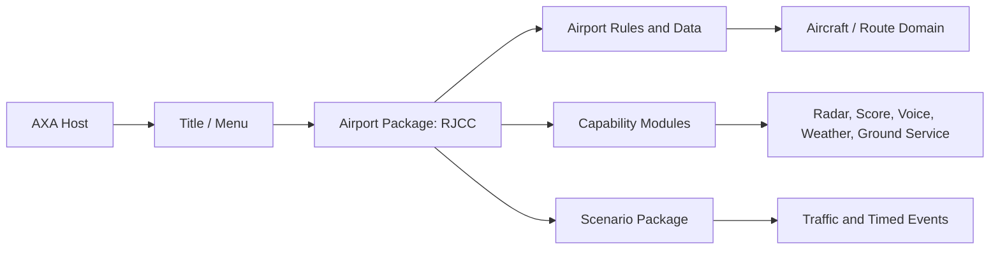
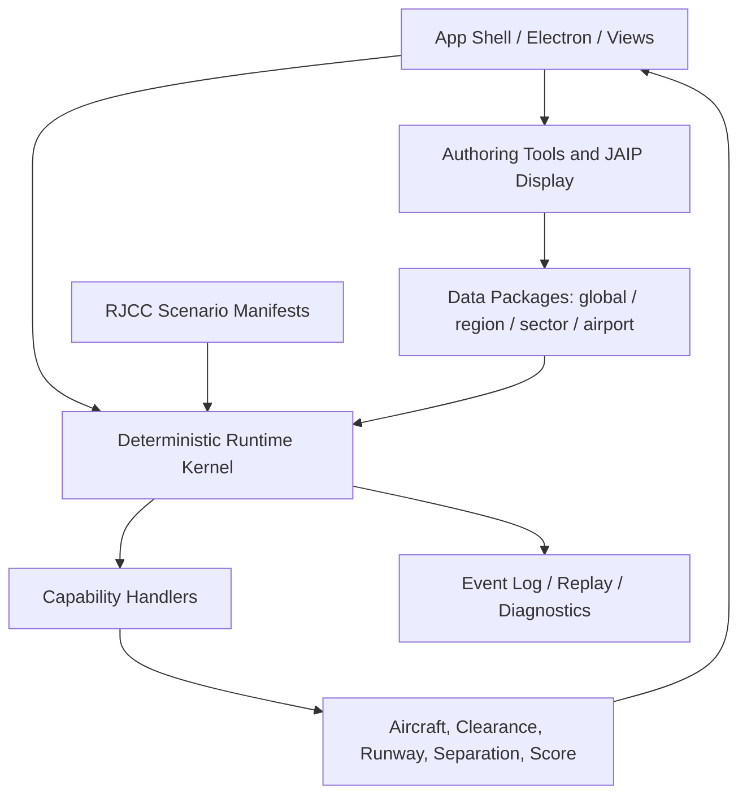

# ATC4 工程结构逆向参照与 RJCC Simulator 采纳计划

## 一、目的与边界

本文记录对本地《我是航空管制官 4》资源与二进制模块进行结构观察后，可用于
`atc-radar-sim` 的工程设计结论。

本次工作目标是学习软件的模块边界、数据组织方式与场景编排方式，而不是恢复、
复制或分发原游戏源码与资源。所有采纳项均应在本项目中独立实现，并继续遵守：

```js
displayOnly: true
guidanceEnabled: false
legs: null
```

在 P2 leg semantics 与明确的 guidance 执行契约建立之前，任何航图描绘结果都
不得驱动飞机运动。

## 二、逆向依据与可信度

本次直接检查的原游戏内容根目录为：

```txt
D:/BaiduNetdiskDownload/ATC4 BKK/ATC4/ATC4BKK
```

### 1. 已验证的模块事实

| 观察对象 | 可验证信息 | 工程含义 |
| --- | --- | --- |
| `AXA.exe` | Product: `Application eXecute Attendant`；导入/加载 `PGSV` 接口 | 游戏存在宿主/应用加载层 |
| `pgsv.dll` | Product: `Pegasus3DV`；导出模型、图层、相机、纹理函数 | 渲染基础设施独立于玩法模块 |
| `acv_d3d92.dll` | 可见 Direct3D/D3DX 字符串 | 图形后端为 Direct3D 9 系路线 |
| `PgsWin5.dll` | 导出窗口、按钮、列表、字体等接口 | UI 控件层独立 |
| `XPACK.dll` / `XPACK2.dll` | 导出 pack file / profile reader | 自定义数据与资源有统一读取层 |
| `PORT/RJCC/ATC4GAME.dll` | `ATC4 GAME RJCC for AXA` | 每个机场可装配自身玩法逻辑 |
| `PORT/RJCC/AISHIP2_ATC4.dll` | 可见路线、移动、跑道检查导出名 | 飞机运动/路线能力是独立领域模块 |
| `PORT/RJCC/APL/*` | 评分、雷达、语音、天气、地勤等模块各有 DLL 与 `apl.ini` | 功能以可配置模块组合 |

所有核心可执行模块均为 x86 原生 PE，包含普通代码/数据/资源段；本次未发现
UPX、VMProtect 或 Themida 等常见壳标记。模块还保留 Visual Studio 2012 的
PDB 构建路径字符串。以上信息足以支持架构层面的分析，但不代表已有原始源码。

### 2. 直接与本项目相关的 RJCC 事实

ATC4 的 `PORT/RJCC` 不是单纯地图素材，而是机场纵向功能包：

| 内容 | 原游戏中的表现 |
| --- | --- |
| 机场定义 | `port.ini` 定义 RJCC 坐标、天气效果、模型、性能参数 |
| 跑道配置 | 民航 `01L/19R`、`01R/19L` 与千岁基地 `18/36` 跑道组共存 |
| 管制席位 | DEL、GND、TWR、DEP、APP，以及 RJCC 特有 `Snow Sweep` |
| 关联机场/基地 | `AREAPORT` 中存在 `RJCJ` |
| 功能模块 | RadarMap、Strip、APU_Score、VoiceActManager、WeatherCast、AppGsSystem 等 |
| 场景类型 | 普通关、进阶关、教程、季节/活动内容 |

RJCC 的中文关卡文本还明确暴露了玩法主题：

- 目视进近以改善晚点。
- 千岁基地车辆横穿跑道。
- F-15J 触地重飞训练。
- 持续降雪与跑道除雪。
- 低能见度导致跑道限制。
- 风向变化与跑道切换。
- 政府专机训练和战机护航。

这与本项目已经出现的 `RJCJ`、降雪、跑道关闭、军机任务与高流量事件高度对应。
可借鉴的不是数据内容，而是将“机场能力”与“关卡编排”分开的结构。

## 三、ATC4 的工程思路还原

### 1. 宿主稳定，机场以纵向包扩展

可观测的加载结构可抽象为：



其价值是：机场不是散落在全局程序里的条件判断，而是带着自己的跑道、席位、
场景、效果和扩展能力一起交付。

### 2. 基础能力与机场特色能力通过模块组合

ATC4 的 RJCC APL 清单同时包含通用功能和机场特色：

- 通用：雷达显示、进度条/strip、评分、相机、声音、天气。
- 机场特色：除雪关联能力、基地车辆/地勤活动、特殊任务事件。

每个模块拥有自己的配置和加载层级。这使得“是否启用某项能力”无需渗透到每个
画面和每个场景分支中。

### 3. 场景描述任务，机场包提供能力

`SCENARIO/.../stage936.ini` 与天气/背景配置说明：关卡负责说明目标、选择天气、
注入特殊事件和设定通关条件；跑道网络、管制席位、显示、飞机运动等仍由机场
和能力模块提供。

因此，除雪不应只是某一个关卡函数里的定时关闭跑道；它应是 RJCC 可以启用的
能力，由需要它的场景调度。

### 4. 管制命令、飞机运动与显示不是同一层

可见模块名表明原游戏将：

- 雷达/strip/UI 表现
- 飞机路线与移动
- 语音反馈
- 风险与效率评分

分为相对独立职责。对本项目而言，最重要的吸收方式是保持现有显示层与未来
guidance 层隔离，并再增加“命令执行事件”作为两者之间的受控边界。

### 5. 安全与效率是两个不同的评分维度

`APU_Score` 配置中可见 `Score`、`OnTimeShips`、`Risk` 和时间量表。工程上这
意味着关卡通关不是仅检查几个计数器，而应把：

- 安全性：冲突、跑道侵入、不稳定进近、错误许可。
- 效率：延误、准点到达、吞吐、合理直航/目视进近。
- 特殊任务：除雪、军机训练、护航或搜救完成情况。

拆成可组合规则，再映射为综合等级或通关条件。

## 四、与当前项目的对照判断

### 1. 已经走对的部分

| 当前项目设计 | 与 ATC4 工程思路的关系 | 决策 |
| --- | --- | --- |
| `global / regions / sectors / airports` 四层数据边界 | 比原游戏的机场目录更显式、更适合 Web 工具链 | 保持 |
| `rjccAirportPackage` 聚合跑道、程序、航图与 authoring | 对应机场纵向包中的静态/制作数据入口 | 继续扩展，但不要塞入运行态 |
| `rjccSectorPackage` 关联 RJCC 与 RJCJ | 对应原游戏 RJCC 中对千岁基地的关联 | 保持 airport/sector 区分 |
| procedure display authoring 与 guidance 隔离 | 比黑盒游戏数据更可审计、更安全 | 严格保持 |
| Canvas 静态图层 + React 交互图层 | 与渲染和逻辑解耦的方向一致 | 保持 |

### 2. 当前最明显的结构债务

| 现状 | 风险 | ATC4 参照后的处理方向 |
| --- | --- | --- |
| `src/simulator/scenarios.js` 同时含场景信息、流量表、目标定义 | 新关卡会让一个文件持续膨胀 | 场景迁入 RJCC 的数据包目录并采用 manifest |
| `src/simulator/simulationLoop.js` 直接按 `scenarioId` 分支触发风变、雪情与跑道开闭 | 特殊任务逻辑侵入通用循环 | 改为通用事件执行器 + 能力处理器 |
| `scenarioStatus.js` 以计数条件判断完成/失败 | 难表达风险与效率的综合等级 | 提炼评分/条件规则引擎 |
| `controllerRoles.js`、`frequencies.js`、`runwayConfigs.js` 当前为空或规划态 | 场景已经表达 APP/TWR/RJCJ 主题，但 sector 数据尚不能承载它 | 先补数据契约与真实来源字段，再接玩法 |
| legacy simulator 与 `core-v2` 两条线并存 | 若直接接通，display data 可能误驱动飞机 | 通过事件/命令执行契约逐阶段迁移 |

## 五、建议的目标架构

不要照搬 DLL 插件体系；在 React/Electron 项目中采用可测试的 JavaScript 领域模块。



### 1. 数据层：保留现行 package 边界

保持现有：

```txt
src/data/global/
src/data/regions/
src/data/sectors/rjcc/
src/data/airports/rjcc/
src/data/airports/rjcj/
```

新增时优先使用：

```txt
src/data/airports/rjcc/scenarios/
  index.js
  morningFlow.js
  windShift19.js
  snowShowerFinal.js
  winterSarFront.js
  foxhoundAdiz.js

src/data/airports/rjcc/capabilities/
  index.js
  snowSweep.js
  rjcjOperations.js
```

场景属于机场可交付内容；能力注册也由机场包声明。`sectorPackage` 仍负责席位、
移交、空域边界和流量政策，不承担单关事件时间线。

### 2. 运行层：从按场景分支转为事件执行

将当前 `simulationLoop.js` 中的特殊分支逐步映射为通用事件：

```js
{
  atSec: 600,
  type: "RUNWAY_AVAILABILITY_SET",
  payload: {
    closedRunways: ["01L"],
    arrivalRunways: ["01R"],
    departureRunways: ["01R"],
    reason: "SNOW_SWEEP"
  }
}
```

建议首批事件类型：

```txt
TRAFFIC_RELEASE
WEATHER_SET
WIND_SET
RUNWAY_AVAILABILITY_SET
RUNWAY_OPERATION_NOTICE
RJCJ_MISSION_START
MISSION_STATE_SET
SCENARIO_MESSAGE
```

运行循环只做时钟推进、到期事件派发和领域更新；“为什么关跑道”以及“任务是否
需要除雪”由场景和 capability handler 表达。

### 3. 能力层：把 RJCC 特色从单一场景中提出

建议把 ATC4 暴露出的 RJCC 特色能力纳入本项目的能力目录，但按自己的范围逐项
实现：

| Capability | 第一阶段范围 | 暂不进入 |
| --- | --- | --- |
| `snowSweep` | 跑道可用性事件、提示、任务条件 | 地面车辆物理运动 |
| `rjcjOperations` | RJCJ 航班/任务释放与状态追踪 | 完整基地地面管制 |
| `visualApproachEfficiency` | 允许场景计入效率目标 | 真实运行适用性判定 |
| `windRunwayTransition` | 风变事件与跑道转换目标 | 自动跑道分配优化器 |

### 4. 命令与 guidance 边界

`core-v2/clearance` 可继续产生结构化管制意图，但需经历下列边界后才可能改变
飞机运动：

```txt
Clearance Draft
  -> Validation
  -> Accepted Command Event
  -> Capability / Authority Check
  -> Future Guidance Executor
  -> Aircraft State Transition
```

在 P2 之前，procedure display route 不参与上述执行链。现有 legacy simulator
可以继续运行，新的 event contract 先用于记录和场景派发。

### 5. 评分、任务和回放

建议将 `scenarioObjectives()` 逐步替换为三类规则：

```js
scoring: {
  safety: { conflictLimit: 0, runwayIncursionLimit: 0 },
  efficiency: { onTimeTarget: 4, delayBudgetSec: 240 },
  mission: [{ type: "RJCJ_RECOVERY_COMPLETE", targetId: "EAGLE01" }]
}
```

运行层输出不可变的 domain events，评分层订阅事件形成结果；同一事件日志也可用
于重放、调试和关卡 QC。这比在 React 状态更新函数中分散计算结果更容易复现。

## 六、落地顺序

本计划不应打断当前 SOSHU/DALBI 的 display production 工作。建议增加一条并行
的 runtime architecture track：

### Track D：继续现有 Display Production

| 阶段 | 内容 | 通过标准 |
| --- | --- | --- |
| D0 | 收束 SOSHU initial display gate | 视觉验收、QC 通过、仍为 display-only |
| D1 | 验证 DALBI 长路线生产流程 | manifest/preview/overlay/status 一致 |
| D2 | 批量推进 SID display atlas | 每条路线单独通过 QC |

### Track R：吸收 ATC4 的运行架构思路

| 阶段 | 内容 | 修改范围 | 通过标准 |
| --- | --- | --- | --- |
| R0 | 固定 scenario/event/capability 契约 | 文档与小型纯函数测试 | 不改变当前玩法 |
| R1 | 把一个现有关卡迁移为 declarative scenario manifest | 优先 `winter_sar_front` | 新旧运行结果可对照 |
| R2 | 引入通用 scenario runner，移除该关卡在循环内的硬编码分支 | runtime + tests | 风变/除雪/跑道切换一致 |
| R3 | 抽出安全/效率/任务评分模型 | scoring + scenario status | 当前完成/失败规则不回归 |
| R4 | 增加 deterministic event log 与 replay 基础 | runtime diagnostics | 相同 seed/指令可复现 |
| R5 | 将 RJCJ 特殊任务变为 capability | airport package + runtime | 不污染普通 RJCC 流量 |

### Track G：未来 Guidance，保持门槛

只有满足以下条件才进入 G0：

- SID display production 至少有稳定的 verified RNAV seeds。
- `legs` 数据语义、约束和验证模型另行建立。
- clearance accepted event 与 guidance executor 契约完成。
- legacy 与新 runtime 的回归基线存在。

## 七、第一批具体改动建议

在完成当前未提交的 SOSHU 文档/显示工作后，建议下一次工程提交只做下列范围：

1. 新建 `src/data/airports/rjcc/scenarios/` 结构和 scenario manifest schema。
2. 仅迁移 `winter_sar_front` 的配置、traffic timeline 与雪情/跑道事件描述。
3. 新建纯函数 `dispatchScenarioEvents()` 或同等职责模块，由旧循环调用。
4. 保持当前飞机运动、procedure route builder、clearance prototype 不变。
5. 为时间点 `480/600/960/1080/1680` 的除雪事件写回归检查。

选择 `winter_sar_front` 作为首个迁移对象的理由是：它最能验证 ATC4 RJCC
结构中“机场能力由场景调用”的核心价值，同时无需触碰当前 SID display 工作。

## 八、不采纳的做法

| 原游戏可见做法 | 本项目决定 |
| --- | --- |
| 各机场包包含自己的原生游戏 DLL | 不复制；使用共享 runtime + 数据/能力注册 |
| 场景核心时间线使用不可读的编译资源 | 不复制；场景保持明文、可测试、可 diff |
| 原游戏资产与内部格式 | 不导入项目，不作为发布内容 |
| 从显示线路直接推断可飞航迹 | 明确禁止，继续使用 `displayOnly` 安全门槛 |

## 九、完成定义

本次 ATC4 参照真正产生价值的判断标准不是“看起来像原游戏”，而是：

- RJCC 的场景内容可以作为机场包持续扩充。
- 通用运行循环不再随着特殊关卡增长大量 `scenarioId` 分支。
- 除雪、基地任务、风变和评分成为可测试的能力/规则。
- 事件日志使关卡行为可以回放和复核。
- procedure display 与 aircraft guidance 的边界在扩展玩法后仍然清晰。

